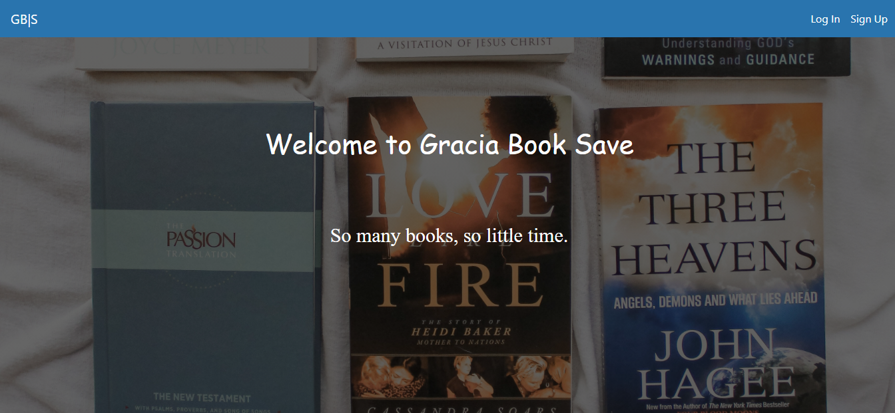

# README

This is the capstone project of the Microverse Ruby on Rails curriculum. It is built with the MVP approach. .This project has the following features:

- Users can crate an account with a username and login

- Users can create a group for books

- Users can create a books for single and multiple groups

- Users can create a book without a group

- Users can create, edit and delete .

## Description:

#### After log in a user can see:

- My expenses.
- My external expenses.
- All groups.

### When user opens "My expenses" and "My external expenses" page:

- The name of the user is displayed.
- Total amount is displayed according to grouped and ungrouped expenses.
- A list of all expenses created by logged-in user is displayed (sorted by most recent).
- Each expense displays its name, amount and date, and an icon of the group; if it has been assigned to.
- An action button "Add new" is displayed.

### When user opens "All groups" page:

- A list of all groups is displayed  in alphabetical order.
- Each group displays its icon and name.
- Each group can be edited.
- An action button "New Group" is displayed.

## Built With
- Rails
- Ruby,
- HTML
- CSS
- ERB
- Bootstrap
- Rspec

### Prerequisites

- Ruby: 2.7.1 
- Rails: 6.0.3.2

### Install and Setup

- Clone repo to your local `https://github.com/GraceOyiza/Book_transaction.git`
- cd into the cloned repo
- OPen a terminal in the root of the app
- Run `yarn install --check-files`
- Run `bundle install`
- Run `rails db:reset`
- Run `rails db:migrate`
- Run Start up you server with `rails s`
- Open http://localhost:3000/ in your browser.

### Testing
- Open a terminal and run `rspec`.

## Author

👤 **Popoola Grace Boluwatife**

- Github: [@GraceOyiza](https://github.com/GraceOyiza)
- Twitter: [@_PopsonGrace](https://twitter.com/_PopsonGrace)
- LinkedIn: [@grace](https://www.linkedin.com/in/grace-popoola)

## 🤝 Contributing

Contributions, issues and feature requests are welcome!

Feel free to check the [issues page](https://github.com/GraceOyiza/Book_transaction/issues).

## Show your support

Give a ⭐️ if you like this project!

## Acknowledgments

- Microverse
- Stack-overflow
[Design By: Gregoire Vella on Behance](https://www.behance.net/gallery/19759151/Snapscan-iOs-design-and-branding?tracking_source=).

## 📝 License

